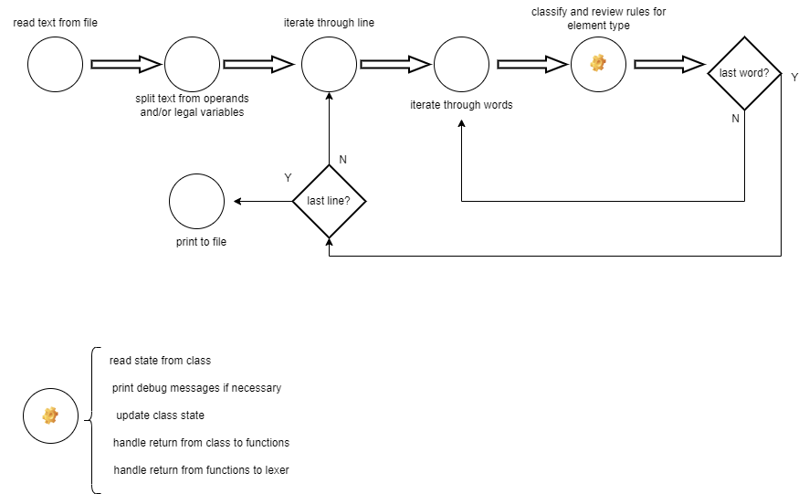
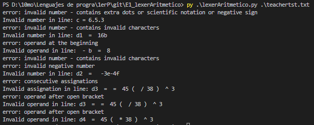

# lexerAritmetico

Program that from a txt file name extracts data from file and clasifies it as if it were a compilation.

program functional diagram:


## Dependencies and instalation

To install please clone or download the repo to your computer. To clone, install git to your environment and execute.

```bash
git clone https://github.com/NicolasBecerraMachado/E1_lexerAritmetico.git
```

To download expand the green menu <Code> and select "Download ZIP". Decompress and follow next steps.

Program developed and tested with Python 3.11.2
to install and/or update please refer to https://www.pythoncentral.io/how-to-update-python/

Required packages: os, sys. Both of them standard libraries.
    
## Usage/Examples

From terminal in folder containing the script and libraries.

```python
py .\lexerAritmetico.py .\teachertst.txt
```
```python
py .\lexerAritmetico.py .\test.txt
```

Feel free to modify these 2 txt files and/or add your own.

The output will be stored in output.txt and will overwrite previous files with that name, please be aware and rename your files to avoid data loss.

The errors are displayed as verbose in the terminal, consume and store them as is more convenient.




## Authors

- [@NicolasBecerraMachado](https://github.com/NicolasBecerraMachado)

